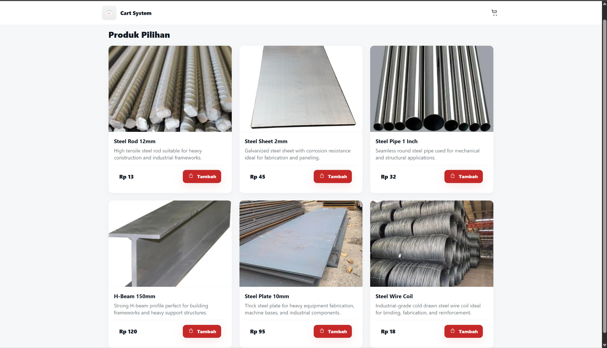
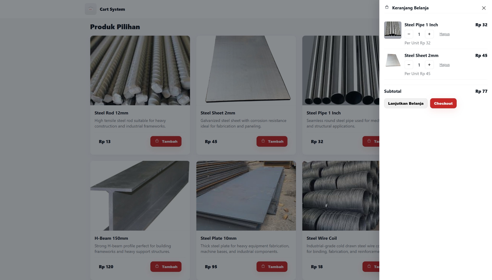

# 🛒 Cart System  
Vue 3 + TypeScript · Pinia · Node.js Express · Prisma ORM · Supabase Postgres

A modern and modular cart system built with Vue 3 (frontend) and Node.js Express TypeScript + Prisma ORM (backend), menggunakan Supabase Postgres sebagai database. Dibangun dengan arsitektur yang clean, scalable, dan mudah dikembangkan.

## 📌 Overview

**Cart System** adalah mini e-commerce dengan fitur keranjang belanja lengkap dan integrasi database real-time menggunakan Supabase.

Terdiri dari:

- **Frontend** — Vue 3 + TypeScript + Pinia + Vite  
- **Backend** — Node.js + Express + TypeScript + Prisma ORM  
- **Database** — Supabase Postgres  
- **Storage** — Supabase Storage  

Cocok untuk:
- Mini e-commerce  
- Inventory demo  
- Studi kasus Vue + Prisma  
- Pembelajaran arsitektur modern fullstack  

---

## 🎨 Frontend (Vue 3 + TypeScript)

Fitur:

- List produk yang clean & responsif  
- Drawer keranjang (slide-right)  
- Tambah produk ke keranjang  
- Kontrol quantity (+/−)  
- Hapus item  
- Subtotal otomatis  
- Pinia store untuk global state  
- Gambar produk via Supabase Storage  
- UI clean, minimalis, dan mobile-friendly  

---

## 🧩 Backend (Node.js + Express + TypeScript + Prisma ORM)

Fitur:

- REST API modular  
- Server ditulis menggunakan TypeScript  
- Prisma ORM untuk query cepat & aman  
- Relasi database lengkap (Product → CartItem → Cart)  
- Validasi dan normalisasi data  
- Mudah diperluas untuk fitur authentication & checkout  

Endpoint utama:

- `GET /products`  
- `GET /cart`  
- `POST /cart/add`  
- `PATCH /cart/update`  
- `DELETE /cart/remove`  

---

## 🗃️ Database — Supabase Postgres

Tables:

- **products**
- **cart**
- **cart_items**

Supabase Storage:

- **product-images/** (gambar produk)

---

## 🖼️ Screenshots

# Product List  


# Drawer Keranjang
  

---

## 📦 Tech Stack

| Layer      | Teknologi |
|------------|-----------|
| Frontend   | Vue 3, TypeScript, Vite, Pinia |
| Backend    | Node.js, Express, TypeScript, Prisma ORM |
| Database   | Supabase Postgres |
| Storage    | Supabase Storage |
| Styling    | CSS Utility / Custom |

---

## 📁 Folder Structure

### Frontend
```
frontend/                    
    ├── src/
    │   ├── components/          
    │   ├── views/               
    │   ├── stores/              
    │   ├── services/           
    │   ├── router/              
    │   └── types/               
    │
    └── public/                  
  
```

### Backend
```
backend/                     
   ├── src/
   │   ├── routes/              
   │   ├── controllers/         
   │   ├── services/            
   │   ├── middlewares/         
   │   ├── dtos/                
   │   └── utils/               
   │
   ├── prisma/                  
   └── api/
```

---

## 🗃️ Prisma Schema

```prisma
model Product {
  id          String   @id @default(uuid())
  sku         String   @unique
  name        String
  description String?
  price       Decimal  @db.Decimal(10,2)
  stock       Int
  image       String?   
  createdAt   DateTime @default(now())
  updatedAt   DateTime @updatedAt
  CartItems   CartItem[]
}


model Cart {
  id        String      @id @default(uuid())
  items     CartItem[] 
  createdAt DateTime    @default(now())
  updatedAt DateTime    @updatedAt
}

model CartItem {
  id        String   @id @default(uuid())
  cartId    String
  productId String
  qty       Int
  price     Decimal  @db.Decimal(10,2)
  cart      Cart     @relation(fields: [cartId], references: [id], onDelete: Cascade)
  product   Product  @relation(fields: [productId], references: [id], onDelete: Restrict)

  @@index([cartId])
  @@index([productId])
}

```

---

## 🎛️ Pinia Store — Cart

Fitur Store:

- `addLocalItem()`  
- `increment()`  
- `decrement()`  
- `remove()`  
- `setQty()`  
- `clear()`  

Computed:

- `total` — subtotal  
- `totalItems` — total qty  

---


## 🛠️ Installation

### 1. Clone Repository
```bash
git clone <repo-url>
cd cart-system
```

## ▶️ Frontend Setup
```bash
cd frontend
npm install
npm run dev
```

## ▶️ Backend Setup (Node.js + Express + TypeScript)
```bash
cd backend
npm install
npx prisma migrate dev
npm run dev
```

### File `.env` backend:
```
DATABASE_URL="postgresql://..."
DIRECT_URL  ="postgresql://..."
```

---

## 👨‍💻 Development Scripts

### Frontend
```bash
npm run dev
npm run build
```

### Backend
```bash
npm run dev
npm run build
npm start
```


## 📄 License

**MIT License** — bebas digunakan untuk keperluan pribadi maupun komersial.
